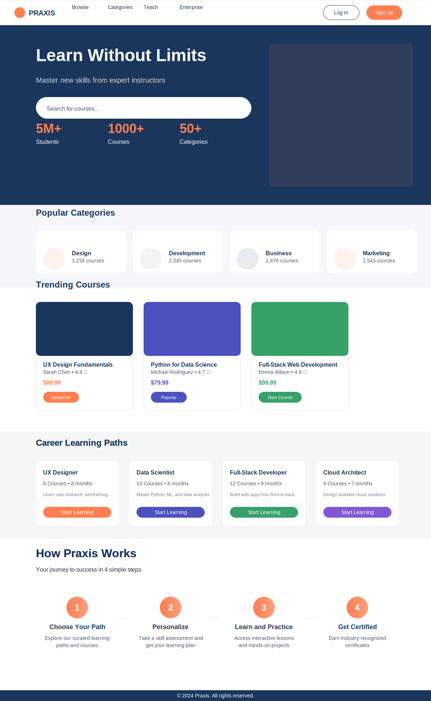

# Praxis Learning Platform

## Overview
Praxis is a cutting-edge online learning platform that seamlessly connects educators and learners through an intuitive, feature-rich environment. Built with React and powered by Firebase's robust infrastructure, Praxis delivers a responsive, real-time learning experience that adapts to modern educational needs.

## Core Features

### Immersive Learning Experience
- Dynamic video-based courses with adaptive playback controls
- Interactive curriculum structure with real-time progress tracking
- Comprehensive resource management for supplementary materials
- Integrated quiz system for knowledge assessment
- Smart progress tracking with automatic resumption

### For Educators
- Streamlined course creation interface
- Intuitive curriculum builder
- Professional video content management
- Flexible resource upload system
- Real-time student progress monitoring
- Custom pricing configuration

### For Students
- Personalized learning dashboard
- Advanced course search and filtering
- Category-based course navigation
- Progress tracking across all enrolled courses
- Certificate generation upon completion
- Resource download management

## Technical Excellence

### Modern Architecture
- Built with React and Vite for optimal performance
- Material UI components for a polished, professional interface
- Real-time updates powered by Firebase
- Responsive design for seamless cross-device experience

### Security & Authentication
- Multi-provider authentication support (Email, Google, Facebook)
- Role-based access control
- Secure content delivery
- Advanced data privacy measures

### Performance
- Optimized video delivery
- Smart caching strategies
- Lazy loading for improved load times
- Real-time synchronization

## Why Praxis?

### For Educational Institutions
- Scalable infrastructure for growing student bases
- Comprehensive analytics and progress tracking
- Customizable learning paths
- Professional content delivery system

### For Independent Educators
- Easy-to-use course creation tools
- Professional content hosting
- Student engagement tracking
- Flexible pricing options

### For Students
- Intuitive learning interface
- Cross-device progress synchronization
- Comprehensive resource access
- Interactive learning experience

## Technical Infrastructure

### Firebase Integration
- Real-time database for instant updates
- Secure file storage and delivery
- Scalable authentication system
- Cloud functions for advanced features

### Modern Frontend
- Material UI for consistent design
- Responsive layouts for all devices
- Optimized performance
- Accessibility-first approach

Praxis represents the future of online learning, combining powerful technology with an intuitive user experience to create an engaging educational environment for both educators and learners.